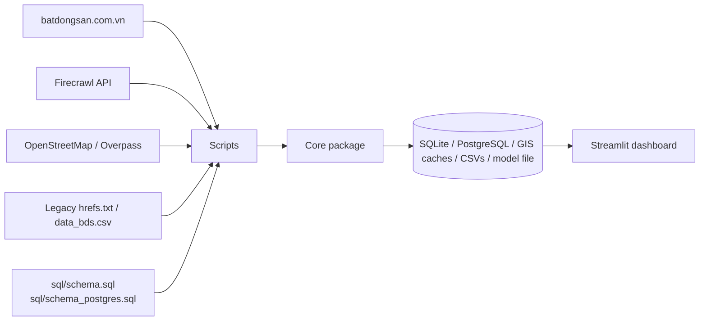
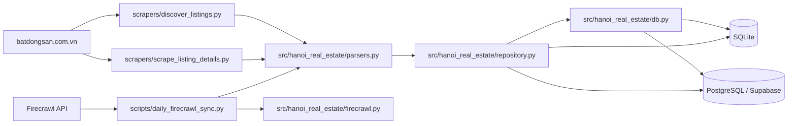
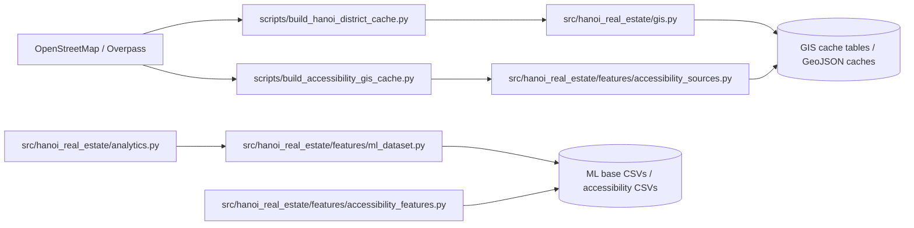
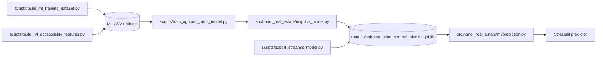
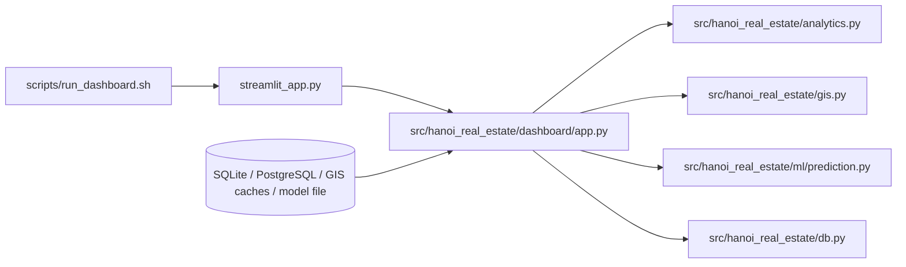

# Hanoi Real Estate Prices Analysis and Recommendation System

Live website: https://hanoirealestateprices-bnsxy55lsaau8jmmrzvay4.streamlit.app/

This repository is currently **Phase 4** of the project.

## Product Roadmap

This project has been built in stages, with each phase turning it into a more complete product:

- Phase 1: basic scraping, modeling, and visualization
- Phase 2: GIS integration
- Phase 3: deployment to the open internet with a live Streamlit app
- Phase 4: ML model implementation
- Phase 4b: ML fine-tuning and UI/UX refinement
- Phase 5: LLM/RAG integration

## Phase 4

Phase 4 is focused on:

- building the ML model that turns the cleaned listing dataset into price predictions
- integrating GIS-aware features so location, accessibility, and district context improve the model
- keeping the Streamlit predictor usable as a product-style interface, not just a notebook demo
- comparing the model against simpler baselines so improvements are measurable
- supporting a click-to-select map flow so the user can place a house directly on the map
- keeping the prediction stack compatible with Supabase/PostgreSQL and the hosted dashboard

At this stage, the system supports:

- `discover_listings.py` to discover listing URLs for deeper local scraping and repair runs
- `scrape_listing_details.py` to scrape listing details with resume behavior through database state
- `daily_firecrawl_sync.py` to perform daily incremental Firecrawl ingestion into PostgreSQL/Supabase
- GIS cache refresh inside the daily sync so hosted map layers stay up to date
- import scripts for:
  - `hrefs.txt` / `hrefs_old.txt`
  - `data_bds.csv`
- `analytics.py` for notebook-aligned cleaning and derived metrics
- `features/ml_dataset.py` for district validation, ward cleaning, and ML-ready base data
- `features/accessibility_features.py` for GIS-enriched distance/count features
- `ml/price_model.py` for XGBoost training and baseline comparison
- `ml/prediction.py` for Streamlit prediction inputs and location helpers
- a Streamlit dashboard for:
  - table view
  - distance to Hanoi center vs price per m2
  - regional house price statistics
  - GIS views backed by precomputed PostgreSQL cache tables
  - price prediction with district/ward-aware location selection

## Phase 4b

Phase 4b is the refinement stage before the final LLM layer.

The goal here is to turn the current ML prototype into a more polished product by:

1. improving model quality through feature tuning and validation
2. tightening district, ward, and map-selection behavior
3. cleaning up the prediction workflow for faster user input
4. redesigning the interface so the app feels intentional and commercial
5. reducing friction in the GIS and data-engineering pipeline

## Current Project Structure

- `src/hanoi_real_estate/scrapers/`: live scraping code for URL discovery and detailed scraping
- `src/hanoi_real_estate/firecrawl.py`: Firecrawl client and parsing helpers
- `src/hanoi_real_estate/repository.py`: PostgreSQL/SQLite repository layer plus GIS cache persistence
- `src/hanoi_real_estate/analytics.py`: analysis and feature engineering
- `src/hanoi_real_estate/gis.py`: GIS builders and cached GIS refresh/load helpers
- `src/hanoi_real_estate/features/`: ML dataset cleaning and GIS accessibility features
- `src/hanoi_real_estate/ml/`: model training and prediction helpers
- `src/hanoi_real_estate/dashboard/app.py`: Streamlit dashboard
- `streamlit_app.py`: Streamlit Community Cloud entrypoint
- `scripts/`: DB init, import utilities, and daily Firecrawl sync
- `sql/`: PostgreSQL schema and GIS cache tables
- `data/`: local SQLite database and local artifacts when working outside Supabase

## Full Architecture

This is the project at a glance, split into smaller diagrams so each part stays readable.

### 1) System Overview



### 2) Scraping And Ingestion



### 3) GIS And Feature Engineering



### 4) Model Training And Prediction



### 5) Dashboard And Serving



### How To Read It

- The scraping flow starts with `discover_listings.py`, `scrape_listing_details.py`, and `daily_firecrawl_sync.py`.
- The GIS flow is split into district caching, accessibility caching, and feature generation.
- The ML flow is split into base dataset creation, accessibility enrichment, training, and prediction.
- The dashboard flow shows how the Streamlit app reads from stored data and model artifacts.

## MVP Behavior

### Discovery

The discovery scraper can stop early when it reaches a page that contains only listings already seen in the most recent scraped set. This is intended to avoid crawling deep into old pages unnecessarily during incremental updates.

### Detail scraping

Detail scraping is resumable by design:

- pending work is stored in database state
- successfully scraped listings move to `done`
- failed listings move to `failed`
- stopping the process does not lose progress
- restarting the scraper continues from the remaining pending queue

### Daily sync and hosted GIS behavior

The hosted Streamlit app does not scrape data and does not recompute the heavy interpolation layer live.

- Firecrawl handles the daily incremental sync into Supabase/PostgreSQL
- manual scraping can still be run independently whenever needed
- the daily sync refreshes cached GIS tables after ingestion
- the Streamlit app reads listings and cached GIS layers from PostgreSQL/Supabase

## Technologies Used

- Scraping and parsing:
  - Selenium
  - undetected-chromedriver
  - Firecrawl
  - Requests
  - BeautifulSoup
- Data storage and access:
  - Supabase
  - PostgreSQL
  - SQLite
  - SQLAlchemy
  - Psycopg
- Dashboard and visualization:
  - Streamlit
  - Plotly
  - Pydeck
- GIS and geospatial processing:
  - GeoPandas
  - Shapely
  - Pyogrio
  - OSMnx
- Machine learning:
  - XGBoost
  - scikit-learn
  - joblib

## Known Challenges

This project is intentionally difficult in a few places:

- `batdongsan.com.vn` is hard to scrape reliably because Cloudflare protection makes `undetected-chromedriver` necessary
- scraper output can be noisy and inconsistent, so the dataset needs a non-trivial cleaning layer before ML training
- GIS integration is useful but still fragile, and some boundary or lookup steps can be bug-prone
- Hanoi housing data is messy and highly heterogeneous, which makes price prediction much harder than a simple tabular regression problem

## Useful Commands

Initialize the local database:

```bash
PYTHONPATH=src python3 scripts/init_db.py
```

Discover listing URLs:

```bash
PYTHONPATH=src python3 -m hanoi_real_estate.scrapers.discover_listings --max-pages 200
```

Scrape listing details in resumable batches:

```bash
PYTHONPATH=src python3 -m hanoi_real_estate.scrapers.scrape_listing_details --limit 50 --max-workers 3 --batch-limit 40
```

Import legacy href data:

```bash
PYTHONPATH=src python3 scripts/import_href_file.py hrefs_old.txt
```

Import legacy CSV data:

```bash
PYTHONPATH=src python3 scripts/import_csv_to_db.py
```

Run the dashboard locally:

```bash
./scripts/run_dashboard.sh
```

Run the Streamlit Community Cloud entrypoint locally:

```bash
PYTHONPATH=src streamlit run streamlit_app.py
```

Run the daily Firecrawl sync plus GIS refresh:

```bash
PYTHONPATH=src python3 scripts/daily_firecrawl_sync.py
```

## Deployment Notes

For Streamlit Community Cloud:

- main file: `streamlit_app.py`
- Python version: `3.12`
- use `requirements.txt` for the hosted dashboard dependency set
- configure `DATABASE_URL` in Streamlit app secrets
- keep scraping and manual sync outside Streamlit

For the worker or scheduled sync environment:

- use `requirements-worker.txt`
- configure:
  - `DATABASE_URL`
  - `FIRECRAWL_API_KEY`
- run `scripts/daily_firecrawl_sync.py` once a day
- the daily sync refreshes cached GIS layers in PostgreSQL after ingestion

## Planned Next Phases

The roadmap below is intentionally product-oriented rather than notebook-oriented.

### Phase 4

Build the first practical ML pricing model and keep improving feature engineering, validation, and prediction stability.

### Phase 4b

Fine-tune the model and redesign the UI/UX so the product feels polished:

- improve feature selection and model calibration
- sharpen district and ward handling
- refine the predictor workflow and map interaction
- redesign the dashboard layout and visual language
- make the app feel like a proper web product rather than a data science prototype

### Phase 5

LLM/RAG integration with both the scraped data and ML model outputs to:

- identify pros and cons of each region
- suggest suitable house-buying options for:
  - individuals
  - families
  - investors
